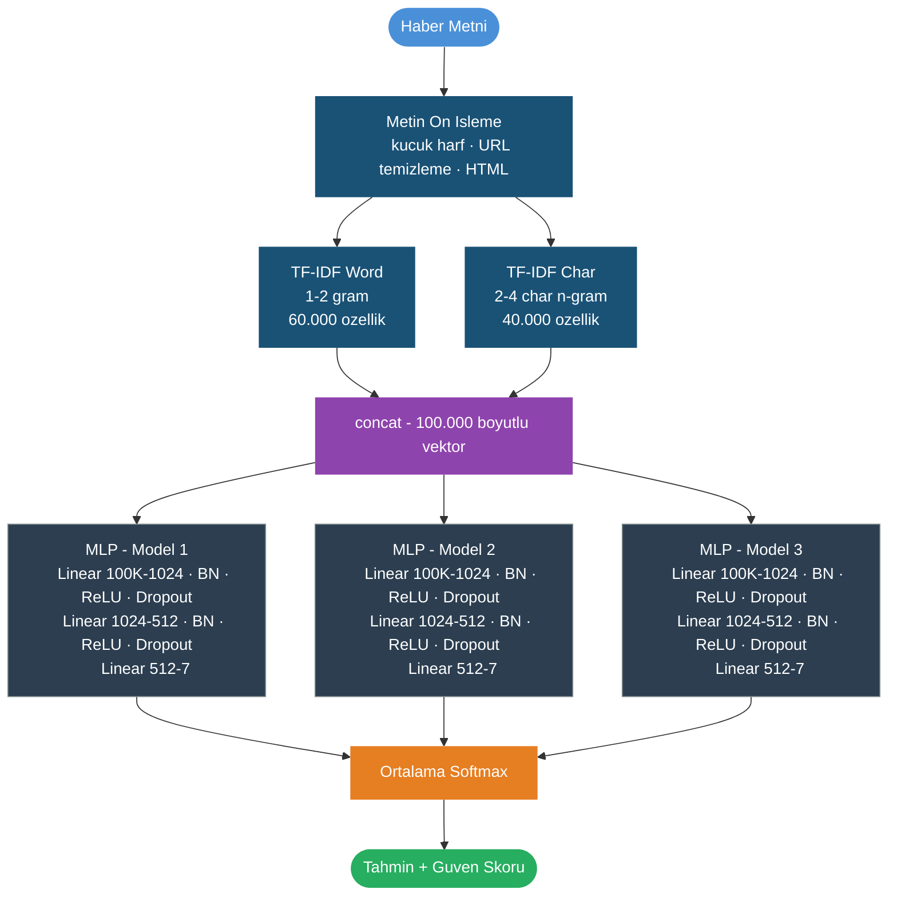

# Türkçe Haber Sınıflandırma — TF-IDF + MLP Ensemble

Türkçe haber metinlerini 7 kategoriye otomatik sınıflandıran makine öğrenmesi projesi.  
Model; TF-IDF öznitelik çıkarımı ve 3'lü MLP ensemble mimarisine dayanmaktadır.

---

## Kategoriler

| # | Kategori | # | Kategori |
|---|----------|---|----------|
| 0 | Ekonomi | 4 | Siyaset |
| 1 | Kültür-Sanat | 5 | Spor |
| 2 | Magazin | 6 | Teknoloji |
| 3 | Sağlık | | |

> Kaynak verisetinde 13 kategori bulunmaktadır; bu projede anlam olarak net ayrışan 7 kategori kullanılmıştır.

---

## Mimari



**Parametreler:** ~35.2M (tek model) &nbsp;|&nbsp; **Cihaz:** CUDA / DataParallel (eğitim) · MPS / CPU (çıkarım)

---

## Veri Seti

**Kaggle:** [`oktayozturk010/42000-news-text-in-13-classes`](https://www.kaggle.com/datasets/oktayozturk010/42000-news-text-in-13-classes)

- ~42.000 Türkçe haber metni, 13 kategori
- Her haber ayrı bir `.txt` dosyası olarak kategori klasörlerine ayrılmış şekilde gelir
- Yapı: `news/<kategori>/<haber_id>.txt`
- 13 kategoriden 7'si kullanıldı; anlam örtüşmesi olan kategoriler elendi

### Veri Bölme

```
Tüm veri
  ├── %87.5  train + val ──┬── %87.5  train
  └── %12.5  test          └── %12.5  val
```

| Split | Oran | Kullanım |
|-------|------|----------|
| Train | ~76.6% | TF-IDF fit + model eğitimi |
| Val   | ~10.9% | Early stopping (F1 izleme) |
| Test  | ~12.5% | Nihai değerlendirme |

### Dengesizlik Çözümü

- Az örnekli sınıflar `OVERSAMPLE_MIN = 3000` eşiğine kadar rastgele tekrarlandı
- Kayıp fonksiyonu `compute_class_weight('balanced')` ile ağırlıklandırıldı

---

## Eğitim Parametreleri

| Parametre | Değer |
|-----------|-------|
| Optimizer | AdamW (lr=1e-3, weight_decay=1e-4) |
| LR Schedule | CosineAnnealingLR (T_max=30) |
| Loss | CrossEntropyLoss (label_smoothing=0.05) |
| Batch Size | 256 (tek GPU) · 512 (DataParallel) |
| Early Stopping | patience=5, val F1 izlenir |
| Max Epoch | 30 |
| Ensemble | 3 model, farklı random seed (0, 1, 2) |
| Platform | Kaggle T4 GPU |

---

## Kaggle'da Eğitim

### 1. Dataset'i Ekle

1. Kaggle notebook'unda sağ panelde **Add data** → **Datasets** seç
2. Arama kutusuna yaz: `42000-news-text-in-13-classes`
3. `oktayozturk010/42000-news-text-in-13-classes` dataseti ekle

### 2. Notebook'u Yükle

1. [kaggle.com/code](https://www.kaggle.com/code) → **New Notebook** → `File > Import Notebook`
2. Bu repodaki `kaggle_egitim_mlp.ipynb` dosyasını yükle
3. Sağ panelde **Accelerator → GPU T4 x1** seç (T4 x2 ile DataParallel da desteklenir)
4. **Run All** — yaklaşık 2-3 saat sürer

Her model için en iyi val F1 checkpoint'i otomatik kaydedilir; early stopping tetiklenirse eğitim erken biter.

### 3. Modeli İndir

Eğitim tamamlanınca:

```
Kaggle → Output → turkish_news_mlp_model.zip → Download
```

ZIP'i aç, içindekileri `model/` klasörüne koy:

```
model/
├── mlp_model_0.pt       # ~393 MB — gitignore
├── mlp_model_1.pt       # ~393 MB — gitignore
├── mlp_model_2.pt       # ~393 MB — gitignore
├── tfidf_word.pkl
├── tfidf_char.pkl
├── mlp_config.json
├── id2label.json
└── label2id.json
```

> `.pt` dosyaları GitHub limitini (~100 MB) aştığından `.gitignore`'a alınmıştır.

---

## Dosya Yapısı

```
turkce-haber-siniflandirma/
├── kaggle_egitim_mlp.ipynb   # Kaggle eğitim notebook'u
├── mlp_model.py              # NewsMLP sınıfı tanımı
├── predict.py                # Terminal inference scripti
├── test_haberler.py          # Etiketli haberlerle doğruluk testi
├── requirements.txt
├── model/                    # Eğitilmiş model dosyaları
│   ├── tfidf_word.pkl
│   ├── tfidf_char.pkl
│   ├── mlp_model_0.pt        # ← gitignore (Kaggle'dan indir)
│   ├── mlp_model_1.pt        # ← gitignore (Kaggle'dan indir)
│   ├── mlp_model_2.pt        # ← gitignore (Kaggle'dan indir)
│   ├── mlp_config.json
│   ├── id2label.json
│   └── label2id.json
└── haberler/                 # Kategori bazlı el yapımı test haberleri
    ├── 0_ekonomi/
    ├── 1_kultur-sanat/
    ├── 2_magazin/
    ├── 3_saglik/
    ├── 4_siyaset/
    ├── 5_spor/
    └── 6_teknoloji/
```

---

## Kurulum

```bash
git clone https://github.com/SalihUstun/turkce-haber-siniflandirma.git
cd turkce-haber-siniflandirma
pip install -r requirements.txt
```

`model/` klasörüne `.pt` dosyalarını ekledikten sonra inference scriptlerini çalıştırabilirsin.

---

## Kullanım

### İnteraktif mod

```bash
python predict.py
```

```
Turkce Haber Kategorilendirici (TF-IDF + MLP Ensemble)
Kategoriler: ekonomi, kultur-sanat, magazin, saglik, siyaset, spor, teknoloji
Cihaz: MPS
--------------------------------------------------------------
Haber metni: Beşiktaş bu akşam Fenerbahçe ile kritik bir derbi maçına çıkıyor.

==============================================================
Metin    : Beşiktaş bu akşam Fenerbahçe ile kritik bir derbi ...
--------------------------------------------------------------
Kategori : SPOR
Guven    : 97.3%
--------------------------------------------------------------
Tum skorlar:
  spor              97.3%  ########################### <
  ekonomi            1.1%
  teknoloji          0.6%
  ...
==============================================================
```

### Tek satır tahmin

```bash
python predict.py --text "Merkez Bankası faiz kararını açıkladı."
```

### Skor barlarını gizle

```bash
python predict.py --text "..." --no-bars
```

### Etiketli haberlerle toplu test

```bash
python test_haberler.py
```

---

## Gereksinimler

```
torch>=2.0.0
scikit-learn>=1.3.0
pandas>=2.0.0
numpy>=1.24.0
scipy>=1.10.0
```
